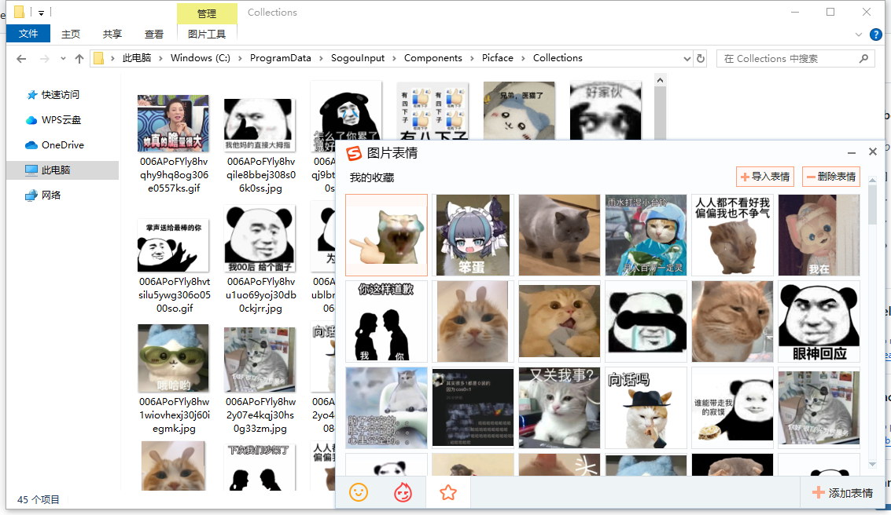
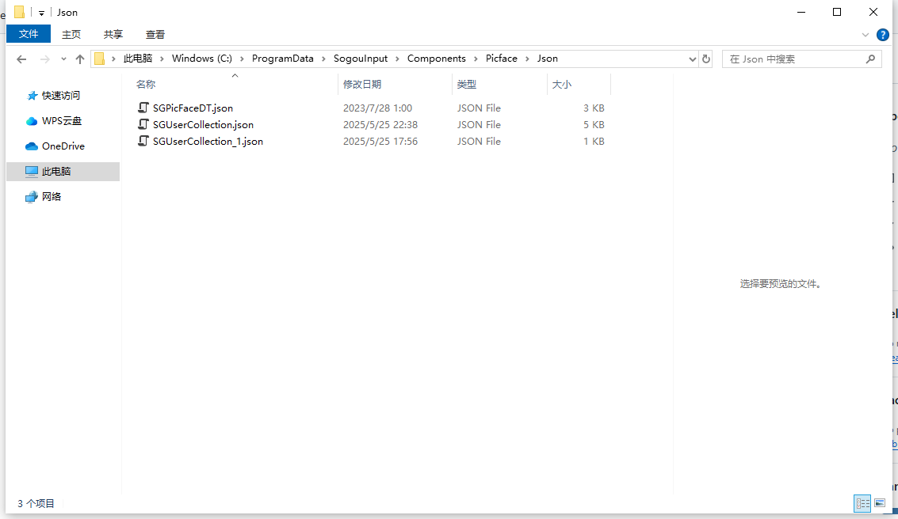
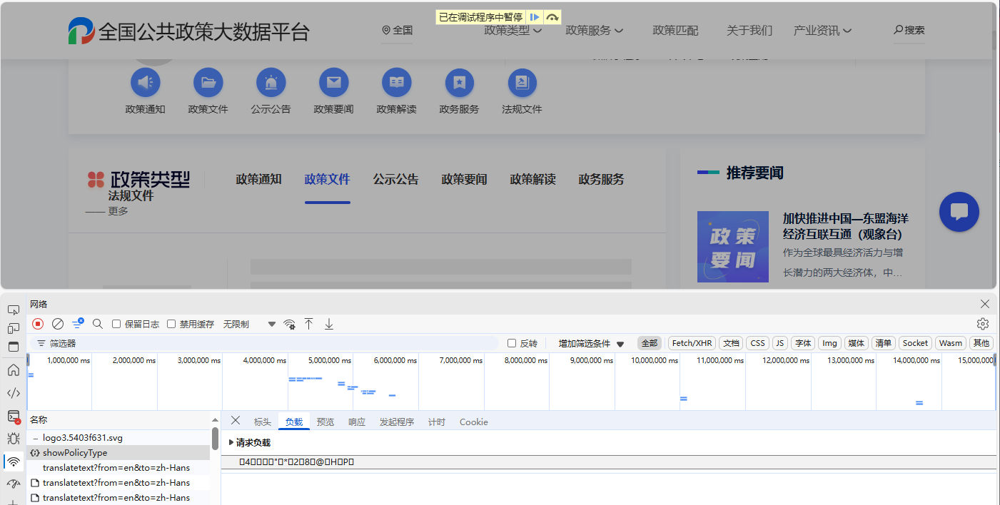
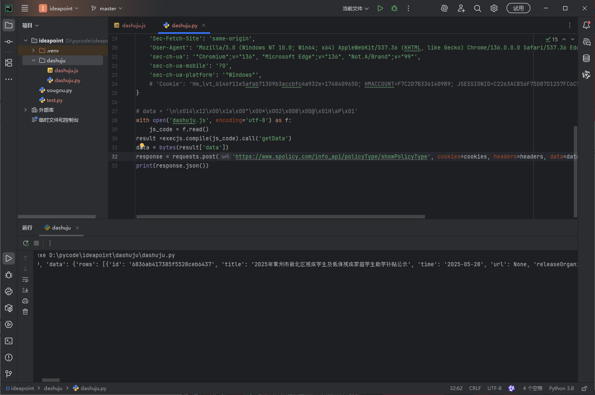
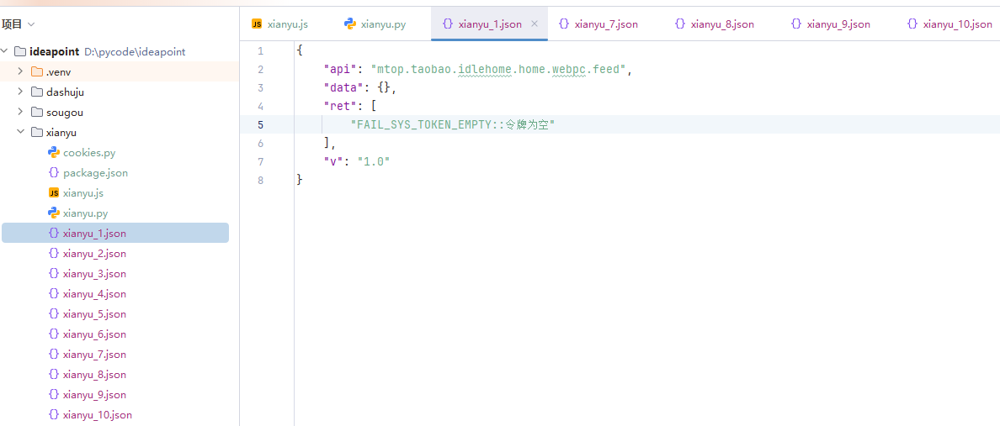
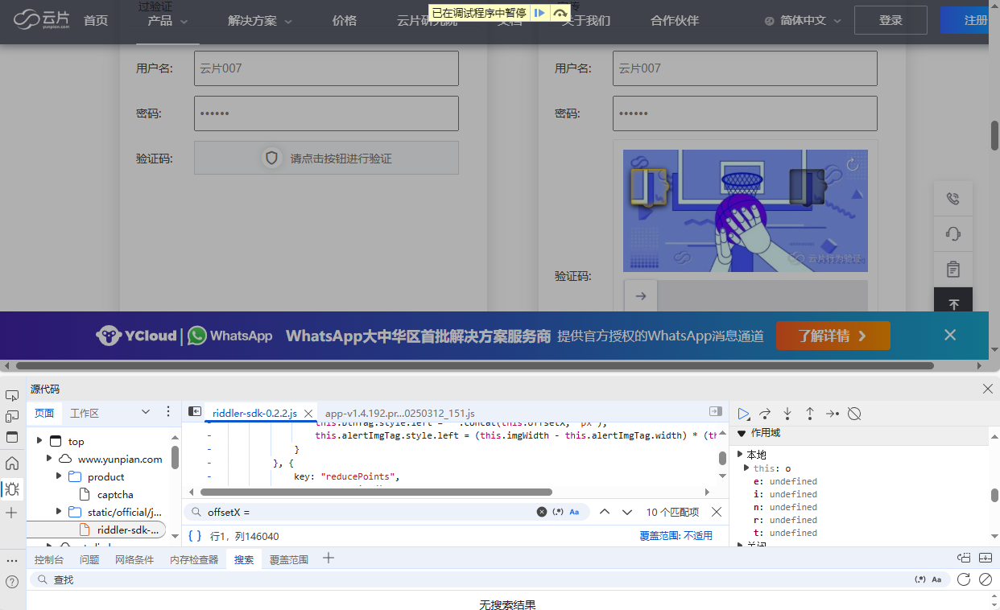
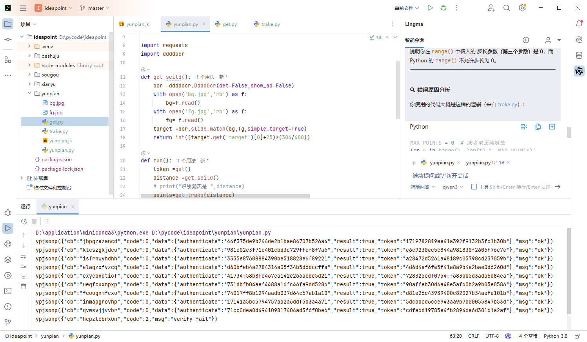

  <li><a href="#第一次作业-----sougou">第一次作业-----sougou</a></li>
  <li><a href="#第二次作业-----dashuju">第二次作业-----dashuju</a></li>
  <li><a href="#第三次作业-----xianyu">第三次作业-----xianyu</a></li>
  <li><a href="#第四次作业-----yunpian">第四次作业-----yunpian</a></li>

### 第一次作业-----sougou
今天是萌新学习python的第二天，还是有些吃力，但好在坚持下来了。好久没用的电脑已经落灰，课间跟群友对线的时候发现自己的表情包已经是很多年前的了，结果一直处于下风，于是决定利用课余时间写了个爬虫脚本，内容是更新搜狗输入法的本地存储，爬虫的链接随便找的，效果如下：

  

只用到requests,还有就是搜狗的本地存储位置是固定的，还要配置一下SGUserCollection.json，就在存储图片的隔壁文件夹，里面放的是图片的位置。看着改吧。

### 第二次作业-----dashuju
断断续续学了点python，虽然很困难但还是出来了。浏览网页时发现数据有乱码，问了ai，说是要逆向什么的，把环境补了补，然后就可以了。
 

### 第三次作业-----xianyu
偶遇知名小网站，拼尽全力瞬间被秒

### 第四次作业-----yunpian
抄的
 

